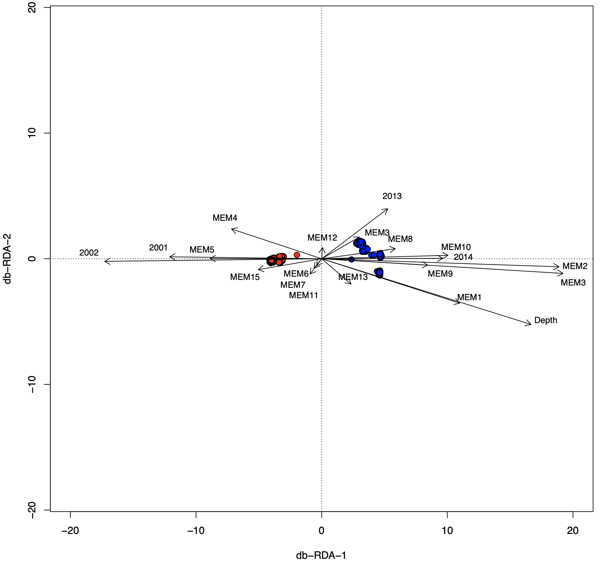

# Codes for the paper : "Population genomics in Sebastes spp."

[](DFO)

_______________________________________________________________________________


#### Caroline Senay, Laura Benestan, Geneviève Parent

Rimouski, 2017-2020

Submited to Evolutionary Applications, 2020


_______________________________________________________________________________

Using multivariate analyses is not an easy task and finding the proper way to perform such analysis is often not so trivial.
Here, we indicated how we used a db-RDA analysis following a step by step tutorial. A genomic distance matrix is used as the response variable, and spatial variables (MEMs), depth, and sampling year are used as explanatory variable.
You will see during this tutorial how the tool of distance-based redundancy analysis can nicely demonstrate the influence of depth on the genomic variation of Sebastes spp.

### Softwares

- [R Version 3.6.0](https://cran.r-project.org/)
	* R packages: codep, adespatial, adegraphics, vegan, ape, car, adegenet, dplyr, assigner

### Data import

Data need to be in genepop format. 
You can easly find functions that can transform your dataset into a genpop format.
For instance the `genomic_converter` function available in the elegant package [assigner](https://github.com/thierrygosselin/assigner)

Import the Genepop file into the R environment:
```{r}
genpop_sebastes <- read.genepop("24603snps_860ind_sebastes.gen",ncode = 3L) # for both species
```

## 1. Prepare the response and explanatory variables 

### Calculate Euclidian distances on a genepop object 

First, estimating individual genetic distances is a crucial step before performing the db-RDA.
The individual genetic distances will be considered as the **response variables**.
```{r}
distgenEUCL <- dist(genpop_sebastes, method = "euclidean", diag = FALSE, upper = FALSE, p = 2)
```

Second, import the environmental dataset, which will contained the **explanatory variables**
```{r}
Env <- read.table("Env_860ind.txt", header=TRUE)
```


Check that **both datasets - response and explanatory variables - are in the same order**.

```{r}
Order <- read.table("Order.txt", header=FALSE)
Order$IND <- substr(Order$V1, 7,12)
Order$SPECIES <- substr(Order$V1,1,3)
Order$SPECIES_NUMBER <- ifelse(Order$SPECIES=="fas",1,2)
```

Merge Order and Env to be in the right Order.
```{r}
Env_order <- merge(Order, Env, by.x="IND", by.y="label_bioinfo",sort=F)
```

Change the Env object for the one in the right order.
```{r}
Env <-select(Env_order,-V1)
```

## 2. Create Moran Eigenvector's Maps (MEMs) to be the spatial variables

Look at sites in space by keeping only latitude and longitude and saving this in the object called Coor.
```{r}
Coor=Env[,5:6]
```

Look the spatial distribution 
```{r}
plot(Coor, asp=1)
```

Compute spatial distances among sites accounting for the earth curvature.
```{r}
DistSpatial=gcd.hf(Env[,5:6]) 
```

**Compute MEM** by keeping default setting for truncation (length of the longest edge of the minimum spanning tree will be used as the threshold) and just positive MEM.
```{r}
dbmem = dbmem(DistSpatial)
```

Look at general output.
```{r}
summary(dbmem)
```

Visualise the links longer than the threshold.
```{r}
s.label(Coor, nb = attr(dbmem, "listw"))
```

Visualise the MEM: the 1rst MEMs are large spatial scales, the last MEMs are small spatial scales.
MEM can be used in stats like any other env variables.
```{r}
s.value(Coor, dbmem[,1:16])
```

## 3. Perform a Principal Coordinates Analysis (PCoA) on the Euclidian distances

**Perform a Pcoa** on genetic distance matrix. 
Genetic distances are then in the multivariate space format, appropriate for running the db-RDA.

```{r}
Pcoa=pcoa(distgenEUCL)
Pcoa
```

"There were no negative eigenvalues. No correction was applied"   
If negative or null eigenvalues are produced, they need to be excluded.

The first four axes explains 99.4% of the enture genomic variation. 
We will keep them all to analyse all genetic variation


**Extract Pcoa principal components**, which will be the response variable in the db-RDA.
```{r}
X=Pcoa$vectors
```

Look at genotypes distribution in relation to the first 2 Pcoa axes
```{r}
plot(X[,1], X[,2])
```

## 4. Selection of explanatory variables
Create a matrix with all expanatory variables, 16 MEMs, depth, and n-1 years coded in dummy variables (2001, 2002, 2008, 2013, 2014)  
```{r}
Y=cbind(dbmem, Env[,7:12])
```

Look at correlation among explanatory variables
```{r}
cor(Y)
```

Nothing problematic. Not surprising cause MEM are orthogonal to each other.
Do a db-RDA global model with all explanatory variables
```{r}
rda1=rda(X, Y)
```

Looking at VIF for multicolinearity within the model. 
Greater than around 10 is problematic.
```{r}
vif(rda1)
```
We don't need to exclude variables because of correlation

Then we look at the explained variance by the global db-RDA model.
Adjusted R2 accounts for the number of variables.
```{r}
RsquareAdj(rda1)
```
 Here, RsquareAdj(rda1) was equal to 37% explained variance.

Assess the db-RDA global model probability
```{r}
anova(rda1, perm=999)
```
The P-value obtained was P-value = 0.001.

Then, use the function `OrdiR2Step`for selecting the relevant variables to use in the db-RDA. 
This function allows to add and remove variables in order to maximise the explained variance. 
To avoid overfitting, selected variables should not explained more than the global model (37%). 

`OrdiR2step` will start working from an empty model without explanatory variables, just the intercept.
```{r}
rda0<-rda(X ~ 1, Y)
```

OrdiR2step will move towards the global model with all explanatory variables
```{r}
rdaG<- rda(X ~ ., Y)
```

**Selection of variables** until the 37% (rda global model) is reached
```{r}
Sel <- ordiR2step(rda0, scope = formula(rdaG), direction="both") 
```

We have a selection of variables. 
```{r}
Sel$anova
```

Spatial scale of the MEM2 the 1rst variables that we get.
```{r}
s.value(Coor, dbmem[,2])
```

Spatial scale of the MEM3
```{r}
s.value(Coor, dbmem[,3])
```

All MEMS
```{r}
s.value(Coor, dbmem[,1:16])
```

## 5. Build a model with the selected variables and vidualize the results

Now build a model with only selected variables
```{r}
Ysel=cbind(Y$MEM3,Y$MEM2,Y$Y2014, Y$Y2013,Y$MEM4,Y$MEM10,Y$MEM6,Y$MEM9,Y$Depth_m,Y$MEM15,Y$MEM1,Y$MEM11,Y$MEM8,Y$Y2002,Y$MEM5,Y$Y2001,Y$MEM12,Y$MEM14,Y$MEM7,Y$MEM13)
rdaS<- rda(X ,Ysel)
summary(rdaS, scaling=1)    
```

Check the RDA summary. Scaling 1 allows the interpretation to focus on the ordination of objects because the distances among objects approximate their Euclidean distances in the space of response variables.
```{r}
RsquareAdj(rdaS)
```

Do a **db-RDA biplot**
```{r}
site=cbind(scores(rdaS, display="sites", choices=c(1,2), scaling=1), Env[,13])
species <- site[,3]
```

Splitting the database by species to give them different colors in biplot
```{r}
Fasciatus=site[site[,3]==1,]
Mentella=site[site[,3]==2,]
```

Create the frame of the RDA.
```{r}
plot(rdaS, scaling=2, main="", type="none", xlab=c("db-RDA-1"), ylab=c("db-RDA-2"), xlim=c(-20, 20), ylim=c(-5, 5))
col2 <- c("blue","red")
```

Add point with a different color for each species.
Some point are getting lost under the other ones.
Can multiply both axis by a constant to rescale it nicely.
```{r}
points(Fasciatus[,1]*3, Fasciatus[,2]*3, col="black",bg="red", pch=21, cex=1.2) 
points(Mentella[,1]*3, Mentella[,2]*3, col="black",bg="blue", pch=21, cex=1.2) 
```

Add arrows showing selected variables pointing to their dbRDA scores
Again can rescale to minimise overlapping of both data source. got to multiply both axis
```{r}
arrows(0,0, scores(rdaS, display="bp", choices=1, scaling=1)*70, scores(rdaS, display="bp", choices=2, scaling=1)*70, col="black", length=0.1)
```


Add variables names
```{r}
text(scores(rdaS, display="bp", choices=1, scaling=1)*75, scores(rdaS, display="bp", choices=2, scaling=1)*75, labels=c("MEM3","MEM2","2014","2013","MEM4","MEM10","MEM6","MEM9","Depth","MEM15","MEM1","MEM11","MEM8","2002","MEM5","2001","MEM12","MEM7","MEM13"), col="black", cex=0.8, pos=3)
```

### Save image of RDA
```{r}
save.image("RDA_all_860ind.Rdata")
```

